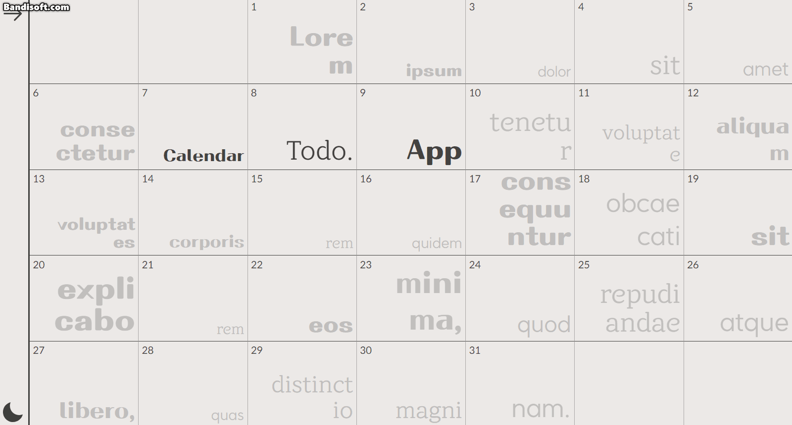

# 라이브러리 및 CSS 연습장

## 1. 캘린더 앱 (django + React + typescript)

[바로가기](https://github.com/MJBaik/03_webPrac/tree/master/reactQuery)

## 2. 스크롤 효과 1 (React + typescript)

[바로가기](https://github.com/MJBaik/03_webPrac/tree/master/scroll)

## 3. 스크롤 효과 2 (React + typescript)

[바로가기](https://github.com/MJBaik/03_webPrac/tree/master/ui-test)

## 4. 채팅 웹소켓 (node.js + React + typescript)

[바로가기](https://github.com/MJBaik/03_webPrac/tree/master/chat-socket)

