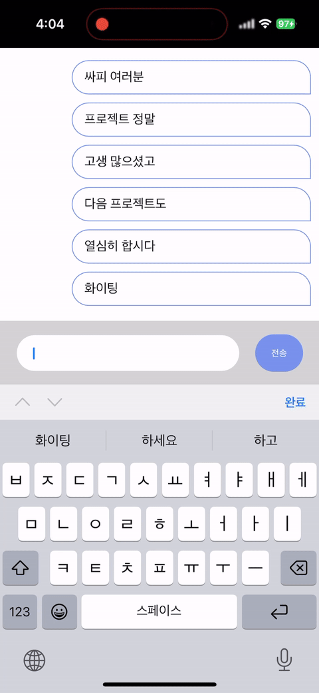

# React (CRA) + typescript + Node.js

- 웹소켓을 이용한 간단한 채팅 앱
- Node.js + socket.io로 채팅 서버 구축
- 이전 프로젝트 중 PWA로 채팅을 구현할 일이 있었는데, 관련하여 UI를 개선하기 위해 제작
- [관련 글](https://codgehog.tistory.com/11)

## 개선 예시

#### 개선 전

- element.scrollTo를 사용한 탓에 채팅 입력 후 채팅 입력창이 화면 아래로 이동

  

#### 중간 단계

- 채팅창 높이를조정하였으나 키보드 뒤로 넣어준 padding이 딸려 올라오는 문제 발생

  

#### 해결

- padding부에 scroll 방지 코드 추가

  
