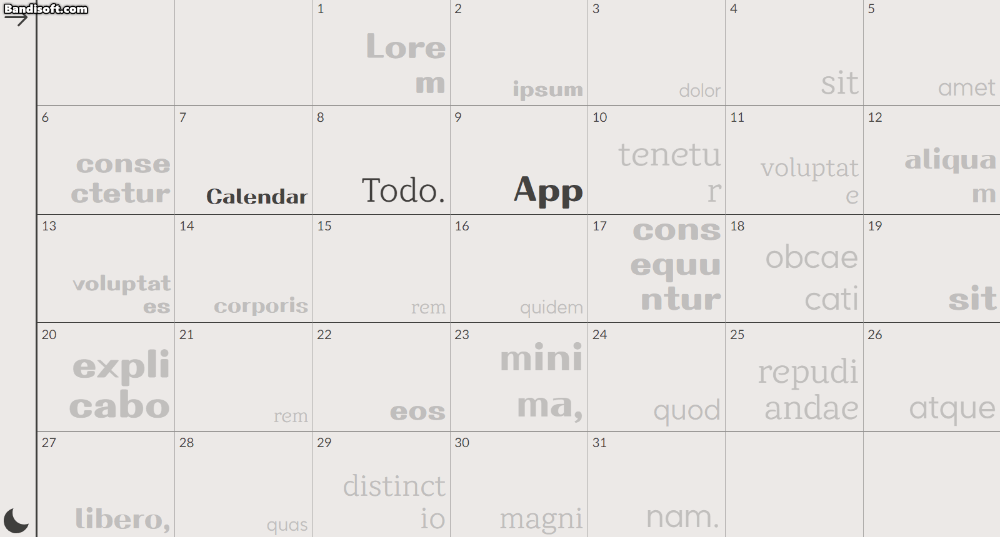
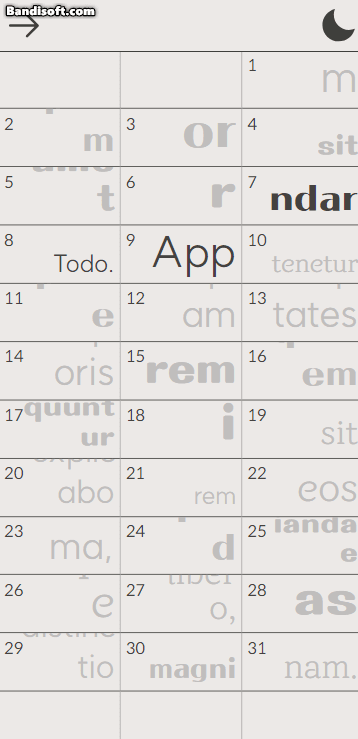
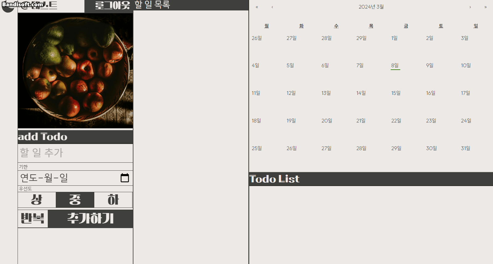

# REACT + typescript + Vite + Django

- React Query 연습을 위한 간단한 todo app
- 사용된 이미지는 프리소스입니다. (출처: https://www.pexels.com/photo/bunch-of-juicy-ripe-apples-and-avocados-in-vase-4832407/)

## tools

- server

  - django
  - django rest api
  - dj-rest-auth
  - corsheaders

- client
  - axios
  - react query
  - zustand
  - styled-components
  - react-calendar
  - react-cookie

## how to install

- server
  ```
  $ cd server
  $ pip install -r requirements.txt
  ```
- client
  ```
  $ cd client
   => .env 파일에 서버 경로 추가 (경로명: VITE_SERVER_URL)
  $ npm i
  $ npm run dev
  ```

## 사용화면

#### 메인화면 및 회원가입



#### 반응형, 다크모드



#### todo 추가 및 우선도에 따른 목록 배치



#### 기한이 정해져 있는 todo 추가 및 리스트에서 해당 todo 확인


