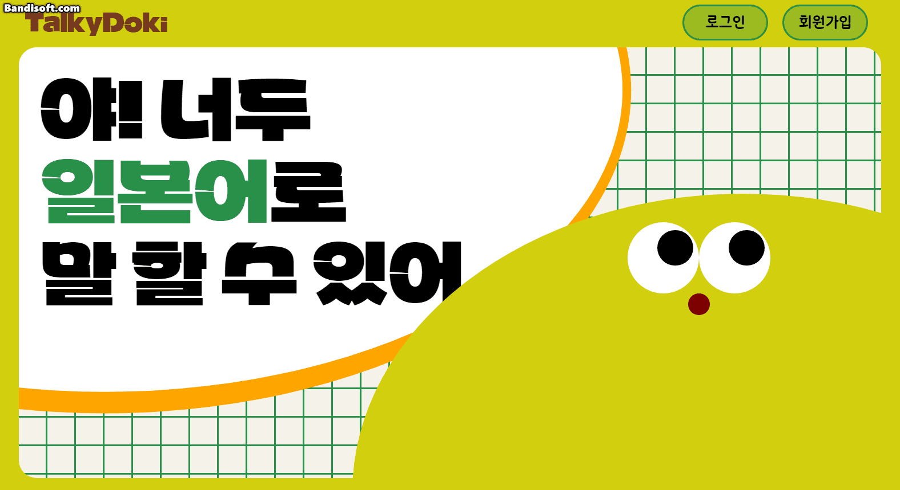
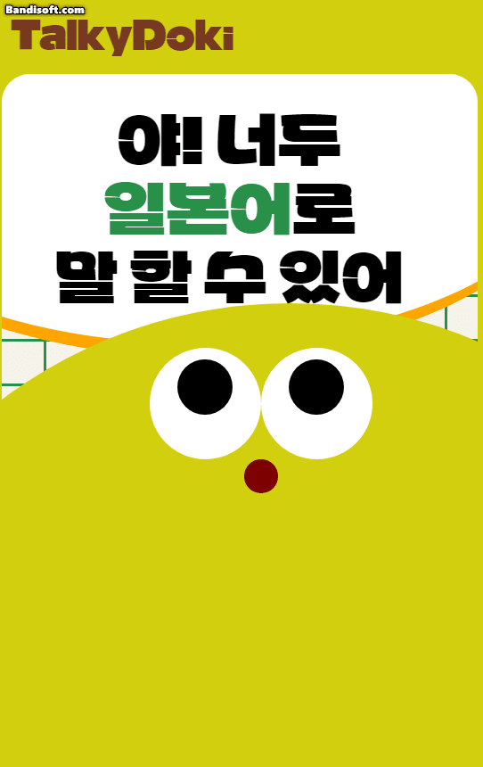

# React + TypeScript + Vite

- 반응형, 스크롤 효과, 클릭 효과, 마우스를 따라 움직이는 캐릭터 element
- 진행 중인 프로젝트에서 사용하고자 샘플용으로 제작한 Intro 페이지... 컨셉이 달라져 파기
- 스크롤 효과나 애니메이션을 한 번쯤 넣어보고 싶어서 시작하였는데 GSAP라는 라이브러리를 발견했다..! 해당 라이브러리를 이용해 조금 더 부드럽게 작동할 수 있도록 수정해볼 예정.

#### 클릭 효과, 마우스를 따라 움직이는 캐릭터 element

#### 스크롤 시 아래에 고정되는 캐릭터, 변경되는 대사, 사라지는 카드

#### 반응형 지원

